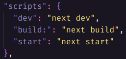
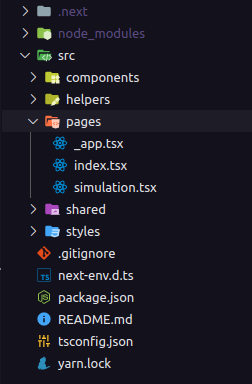

# Next.js: The React Framework

## Next.js has the best-in-class "Developer Experience" and many built-in features; a sample of them are:

<br>

> - An intuitive page-based routing system (with support for [dynamic routes](https://nextjs.org/docs/routing/dynamic-routes))
> - [Pre-rendering](https://nextjs.org/docs/basic-features/pages#pre-rendering), both [static generation](https://nextjs.org/docs/basic-features/pages#static-generation-recommended) (SSG) and [server-side rendering](https://nextjs.org/docs/basic-features/pages#server-side-rendering) (SSR) are supported on a per-page basis
> - Automatic code splitting for faster page loads
> - [Client-side routing](https://nextjs.org/docs/routing/introduction#linking-between-pages) with optimized prefetching
> - [Built-in CSS](https://nextjs.org/docs/basic-features/built-in-css-support) and [Sass support](https://nextjs.org/docs/basic-features/built-in-css-support#sass-support), and support for any [CSS-in-JS](https://nextjs.org/docs/basic-features/built-in-css-support#css-in-js) library
> - Development environment with Fast Refresh support
> - [API routes](https://nextjs.org/docs/api-routes/introduction) to build API endpoints with Serverless Functions
> - Fully extendable

<br>

### Next.js is used in tens of thousands of production-facing websites and web applications, including many of the world's largest brands. Some brands:

<br>

> - Netflix
> - GitHub
> - twitch
> - Uber

<br>

# Pages In Next.js

In Next.js, a page is a **React Component** exported from a `.js`, `.jsx`, `.ts`, or `.tsx` file in the pages directory. Each page is associated with a route based on its file name.

**Example**: If you create `pages/home-equity.js` that exports a React component like below, it will be accessible at `/home-equity`.

```javascript
function About() {
  return <div>About</div>
}

export default About
```

## Pages with Dynamic Routes

Defining routes by using predefined paths is not always enough for complex applications. In Next.js you can add brackets to a page (`[param]`) to create a dynamic route (a.k.a. url slugs, pretty urls, and others).

Consider the following page `pages/users/[userName].js`:

```javascript
import { useRouter } from 'next/router'

const User = () => {
  const router = useRouter()
  const { userName } = router.query

  return <p>Welcome aboard {userName}</p>
}

export default User
```

<br>

# Pre-rendering

By default, Next.js pre-renders every page. This means that Next.js generates HTML for each page in advance, instead of having it all done by client-side JavaScript. Pre-rendering can result in better **performance** and **SEO**.

## Two forms of Pre-rendering

Next.js has two forms of pre-rendering: Static Generation and Server-side Rendering. The difference is in when it generates the HTML for a page.

 - **Static Generation (Recommended)**: The HTML is generated at build time and will be reused on each request.
 - **Server-side Rendering**: The HTML is generated on each request.

 <br>

# Data Fetching

### In Nextjs there are three exclusive functions to fetch data for pre-rendering

<br>

> - `getStaticProps` (Static Generation): Fetch data at **build time**.
> - `getStaticPaths` (Static Generation): Specify dynamic routes to pre-render pages based on data.
> - `getServerSideProps` (Server-side Rendering): Fetch data on **each request**.

<br>

# [`getStaticProps` (Static Generation)](https://nextjs.org/docs/basic-features/data-fetching#getstaticprops-static-generation)

`getStaticProps` should return an object with:

- `props` - A **required** object with the props that will be received by the page component. It should be a serializable object.
- `revalidate` - An **optional** amount in seconds after which a page re-generation can occur. More on [Incremental Static Regeneration](https://nextjs.org/docs/basic-features/data-fetching#incremental-static-regeneration)
- `notFound` - An **optional** boolean value to allow the page to return a 404 status and page. Below is an example of how it works:

```javascript
export async function getStaticProps(context) {
  const res = await fetch(`https://.../data`)
  const data = await res.json()

  if (!data) {
    return {
      notFound: true,
    }
  }

  return {
    props: { data }, // will be passed to the page component as props
  }
}
```

<br>

# [`getStaticPaths` (Static Generation)](https://nextjs.org/docs/basic-features/data-fetching#getstaticpaths-static-generation)

If a page has dynamic routes and uses **`getStaticProps`** it needs to define a list of paths that have to be rendered to HTML at build time.

```javascript
// pages/posts/[id].js

function Post({ post }) {
  // Render post...
}

// This function gets called at build time
export async function getStaticPaths() {
  // Call an external API endpoint to get posts
  const res = await fetch('https://.../posts')
  const posts = await res.json()

  // Get the paths we want to pre-render based on posts
  const paths = posts.map((post) => ({
    params: { id: post.id },
  }))

  // We'll pre-render only these paths at build time.
  // { fallback: false } means other routes should 404.
  return { paths, fallback: false }
}

// This also gets called at build time
export async function getStaticProps({ params }) {
  // params contains the post `id`.
  // If the route is like /posts/1, then params.id is 1
  const res = await fetch(`https://.../posts/${params.id}`)
  const post = await res.json()

  // Pass post data to the page via props
  return { props: { post } }
}

export default Post
```

## When should I use `getStaticPaths`?
You should use getStaticPaths if you’re statically pre-rendering pages that use dynamic routes.

<br>

# [`getServerSideProps` (Server-side Rendering)](https://nextjs.org/docs/basic-features/data-fetching#getserversideprops-server-side-rendering)

`getServerSideProps` should return an object with:

- `props` - A **required** object with the props that will be received by the page component. It should be a serializable object.
- `notFound` - An **optional** boolean value to allow the page to return a 404 status and page.
- `redirect` - An **optional** redirect value to allow redirecting to internal and external resources. It should match the shape of `{ destination: string, permanent: boolean }`. In some rare cases, you might need to assign a custom status code for older HTTP Clients to properly redirect. In these cases, you can use the `statusCode` property instead of the `permanent` property, but not both. Below is an example of how it works:

```javascript
export async function getServerSideProps(context) {
  const res = await fetch(`https://.../data`)
  const data = await res.json()

  if (!data) {
    return {
      redirect: {
        destination: '/',
        permanent: false,
      },
    }
  }

  return {
    props: {}, // will be passed to the page component as props
  }
}
```

<br>

# Image Component and Image Optimization

Since version 10.0.0, Next.js has a built-in Image Component and Automatic Image Optimization.

The Next.js Image Component, `next/image`, is an extension of the HTML `` element, evolved for the modern web.

The Automatic Image Optimization allows for resizing, optimizing, and serving images in modern formats like WebP when the browser supports it. This avoids shipping large images to devices with a smaller viewport. It also allows Next.js to automatically adopt future image formats and serve them to browsers that support those formats.

<br>

## [Image Component](https://nextjs.org/docs/basic-features/image-optimization)

To add an image to your application, import the `next/image` component:

```javascript
import Image from 'next/image'

function Home() {
  return (
    <>
      <h1>My Homepage</h1>
      <Image
        src="/me.png"
        alt="Picture of the author"
        width={500}
        height={500}
      />
      <p>Welcome to my homepage!</p>
    </>
  )
}

export default Home
```

<br>

# Migration to Next.js

## System Requirements

- Server (EC2) in Node.js 10.13 or later
- MacOS, Windows (including WSL), and Linux are supported

<br>

# Setup

The Next.js documentation recommends creating a new Next.js application using `create-next-app`, which automatically configures everything for you. To create a project, run:

```bash
npx create-next-app 
# or
yarn create next-app
```

For more information on how to use create-next-app, you can review the [`create-next-app` documentation](https://nextjs.org/docs/api-reference/create-next-app)

<br>

### If we open the `package.json` file we will see the following:

<br>



These scripts refer to the different stages of developing an application:
- `dev` - Runs `next dev` which starts Next.js in development mode
- `build` - Runs `next build` which builds the application for production usage
- `start` - Runs `next start` which starts a Next.js production server

<br>

This will basically be the structure that we must follow. An important information is that the folder called *"pages"* **cannot** be renamed, as it is from this folder that Nextjs will search for your pages. Putting this folder inside another folder called *"src"* is the maximum that can be done.

<br>



<br>

# React page load time

Regarding **client-side** architecture, or client-side in literal translation, once we load the content we have to wait for the package that contains all the JavaScript or **bundle** as it is known to load before determining what to display on the page. And that makes charging time higher which ends up becoming a problem for people with old mobile devices and weak connections.

When people realized that putting too much JavaScript code on the client side was a problem, they thought of an alternative to rendering that code on the server side. And so the **NextJS** came about, a framework created on top of ReactJS that uses server-side rendering or Server Side Rendering popularly known as SSR.

<br>

# Server Side Rendering - SSR

The SSR works as follows, when accessing a website for example pontte.com.br we send a request to the server to access the homepage of the website, then the server sends a request to a rest api for example asking for this initial page. Once the data is received, the server **renders an HTML page** with the content and sends it to the client, thus displaying the content on the page, if the person accesses another route for example pontte.com.br/simulacao the process remains the same.

Using the SSR concept, *we continue to develop it with React*, which is good, because we can keep the technology we like and a person who is visiting our site gets a simple HTML document, which no end generates a **big performance increase**. Not only that, NextJS has other advantages as well.

## Advantages

- Great at SEO
- Meta tags with more suitable previews
- Better performance for the user (content will be seen faster)
- Less client-side processing

## Disadvantages

- Larger TTFB (Time to first byte), the server will prepare all the content to deliver
- Larger HTML
- Complete reload on route changes

<br>

# Static Site Generation - SSG

Every time a user requests a page, we will take the contents of that page and deliver it, as the files were generated statically, no extra calls will be made and the page will already include the full HTML of the page, this includes the meta- tags and everything.

## Advantages

- Almost zero use of the server
- Best performance
- Flexibility to use any server
- Great SEO

## Disadvantages

- Build time can be very high
- Difficulty climbing in large applications
- Difficulty performing constant updates

<br>
<br>

### References:

- https://nextjs.org/docs
- https://www.alura.com.br/artigos/next-js-vantagens
- https://willianjusten.com.br/nextjs-gatsby-ou-create-react-app-entendendo-os-conceitos-de-ssr-ssg-e-spa/