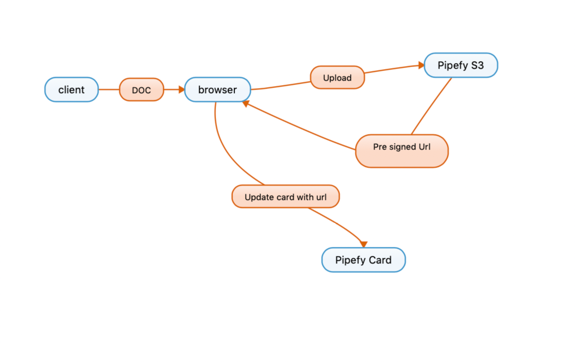

# Document Upload

<details><summary>Document Upload</summary>
<p>
Document Upload Flow


</p>
</details>

## Create Pre-signed URL

> [API. Ref.](https://api-docs.pipefy.com/reference/mutations/createPresignedUrl/)  
> Create a pre-signed URL and get the output url to send a PUT request with the attachment, using Postman.

```graphql
mutation UploadFile($cardId: ID!) {
    createPresignedUrl(input: {fileName: "teste.pdf", organizationId:$cardId}) {
        clientMutationId
        downloadUrl
        url
    }
}
```

<br>

## Update card attachment field

>[Api Ref.]( https://api-docs.pipefy.com/reference/mutations/updateFieldsValues/)   
> Update the attachment field of the card. In this case we need to get the part of downloadedurl starting from "upload/…".

```graphql
mutation {
    updateFieldsValues(input: {nodeId: <cardid>, values: {fieldId: "<field_attachment>", value:["uploads/63c330ba-9747-456d-8862-f616436ea1e8/teste.pdf"], operation: ADD}}) {
        clientMutationId
    }
}
```

<br>
