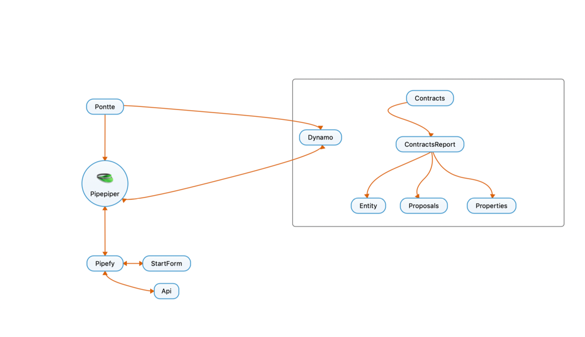

<article>

# Api integration

  there are 2 main wais we can customize and  expand our Pipefy experience
 

<dl>
  <dt>Public GraphQl Api</dt>
  <dd>take advantage of Pipefy`s graphql api from within your app with requests</dd>
  <dt>PipefyApp</dt>
  <dd>run an app from within the pipefy platform.</dd>
  <dd>even though you may still make use of the public APi you now have access to the PpefyApp client which goes a long way on
its own.
</dd>
</dl>

</article>

[^1]: in order to have an elastic dynamic inclusion of data may it be through a third party api ou own onbording or
directly in pipefy.
critereas

- unified data source multiple data entries
- pair data pipefy <----> dynamo

The thought out architecture is as follows.
> A separete api that acts as a middleman bettween `Pipefy` and all `Pontte` clients
>> 

## Summary

- [Attachments](#Document Upload)
- Cards
    - [Delete](#Document Upload)
    - [Create](#Document Upload)
    - [Update](#Document Upload)
    - [Delete](#Document Upload)
- Pipe
    - [List Form Fields](#form fields)

references

### Docs Pipefy API

- https://developers.pipefy.com/reference#what-is-graphql
- https://api-docs.pipefy.com/reference/overview/Card/
- https://pipefypipe.docs.apiary.io/#reference/0/list-pipes
- https://app.pipefy.com/graphiql
